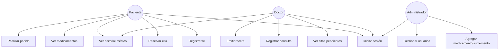
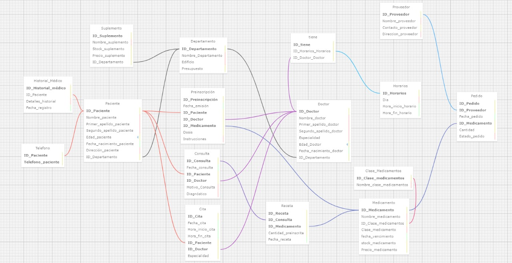
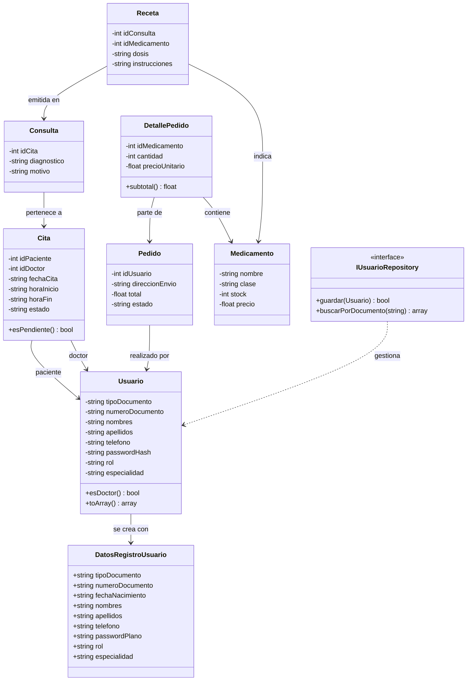
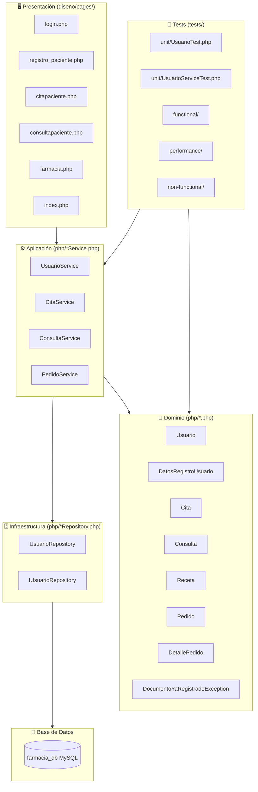

# Proyecto final 

## Integrantes:

- **Baca Flores Gabriel Alejandro**
- **Sierra Huaracha Rodrigo Adolfo**
- **Perez Flores Alyson Gisely**

---

## Propósito del Proyecto

Sistema web para la gestión integral de la Farmacia del Hospital General de Arequipa. Permite administrar usuarios (pacientes, doctores, administradores), citas médicas, consultas, recetas, medicamentos, suplementos y pedidos, con arquitectura modular basada en DDD y pipeline CI/CD completo.

---

## Funcionalidades

### Casos de Uso principales

| Módulo | Actor | Operación |
|---|---|---|
| **Usuarios** | Paciente / Doctor / Admin | Registrarse, iniciar sesión, cerrar sesión |
| **Citas** | Paciente | Reservar cita con un doctor |
| **Citas** | Doctor | Ver y atender citas pendientes |
| **Consultas** | Doctor | Registrar consulta médica y diagnóstico |
| **Recetas** | Doctor | Emitir receta de medicamento durante consulta |
| **Farmacia** | Paciente / Admin | Ver medicamentos y suplementos disponibles |
| **Pedidos** | Paciente | Realizar pedido de medicamentos |
| **Historial** | Paciente / Doctor | Consultar historial médico |




---

## Modelo de Dominio

### Diagrama de Clases (Modelo Lógico)






### Módulos de Dominio (Bounded Contexts)

| Módulo | Entidades principales |
|---|---|
| **Usuarios** | `Usuario`, `DatosRegistroUsuario` |
| **Citas** | `Cita`, `DatosRegistroCita` |
| **Consultas** | `Consulta`, `Receta` |
| **Pedidos** | `Pedido`, `DetallePedido` |
| **Productos** | `Medicamento`, `DatosRegistroProducto` |

---

## Visión General de Arquitectura

### Diagrama de Paquetes




### Estilo arquitectónico: Monolito Modular + DDD

```
┌─────────────────────────────────────────────────────┐
│                    Presentación                      │
│              (diseno/pages/*.php)                    │
├──────────┬──────────┬──────────┬────────────────────┤
│ Usuarios │  Citas   │Consultas │      Pedidos        │
├──────────┼──────────┼──────────┼────────────────────┤
│Aplicacion│Aplicacion│Aplicacion│     Aplicacion      │
├──────────┼──────────┼──────────┼────────────────────┤
│ Dominio  │ Dominio  │ Dominio  │      Dominio        │
├──────────┼──────────┼──────────┼────────────────────┤
│  Infra   │  Infra   │  Infra   │       Infra         │
└──────────┴──────────┴──────────┴────────────────────┘
                BD Centralizada (farmacia_db)
```

### Estructura de carpetas por módulo

```
php/
├── Usuarios/
│   ├── Usuario.php
│   ├── IUsuarioRepository.php
│   ├── UsuarioService.php
│   └── DatosRegistroUsuario.php
├── Citas/
│   ├── Dominio/
│   ├── Aplicacion/
│   └── Infraestructura/
├── Consultas/
│   ├── Dominio/
│   ├── Aplicacion/
│   └── Infraestructura/
├── Pedidos/
│   ├── Dominio/
│   ├── Aplicacion/
│   └── Infraestructura/
└── Productos/
    ├── Dominio/
    └── Aplicacion/
```

---

## Módulos y Operaciones disponibles

### Módulo: Usuarios

| Operación | Método | URL | Parámetros |
|---|---|---|---|
| Registrar usuario | POST | `/php/procesar_registro.php` | `tipo_documento`, `numero_documento`, `nombres`, `apellidos`, `telefono`, `password`, `rol`, `especialidad` |
| Iniciar sesión | POST | `/php/login.php` | `numero_documento`, `password` |
| Cerrar sesión | GET | `/php/logout.php` | — |

### Módulo: Citas

| Operación | Método | URL | Parámetros |
|---|---|---|---|
| Crear cita | POST | `/php/procesar_cita.php` | `id_paciente`, `id_doctor`, `fecha_cita`, `hora_inicio`, `hora_fin` |

### Módulo: Consultas

| Operación | Método | URL | Parámetros |
|---|---|---|---|
| Registrar consulta | POST | `/php/procesar_consulta.php` | `id_cita`, `diagnostico`, `motivo` |

### Módulo: Productos/Farmacia

| Operación | Método | URL | Parámetros |
|---|---|---|---|
| Agregar producto | POST | `/php/procesar_agregar_producto.php` | `tipo`, `nombre`, `clase`, `stock`, `precio`, `imagen` |

### Módulo: Pedidos

| Operación | Método | URL | Parámetros |
|---|---|---|---|
| Realizar pago/pedido | POST | `/php/procesar_pago.php` | `id_usuario`, `productos`, `total`, `direccion_envio` |

---

## Descripción del Proyecto

### Farmacia del Hospital General de Arequipa

La farmacia del Hospital General se asegura de que cada aspecto de su cita, reserva, receta, etc., esté meticulosamente documentado y organizado. Esta estructuración detallada facilita la gestión eficiente de la farmacia, asegura un servicio de calidad para los pacientes y permite una colaboración fluida entre los diferentes departamentos y personal médico.

## Levantamiento y Análisis de Requisitos

### Departamentos
- Cada farmacia está dividida en departamentos.
- Para cada departamento, se desea guardar su identificador, nombre, edificio y presupuesto.

### Doctores
- Cada doctor está asignado a un departamento.
- Para cada doctor, se almacena su identificador, nombre completo (nombres, primer apellido y segundo apellido), especialidad, edad y fecha de nacimiento.

### Pacientes
- Cada paciente está asignado a un departamento.
- Para cada paciente, se almacena su identificador, nombre completo (nombres, primer apellido y segundo apellido), edad, fecha de nacimiento, teléfonos de contacto, dirección e historial médico.

### Medicamentos
- Cada medicamento está asignado a una clase de medicamentos.
- Para cada medicamento, se almacena su identificador, nombre del medicamento, clase de medicamento (antiinflamatorio, antibiótico, etc.), fecha de vencimiento, stock actual y precio.

### Clases de Medicamentos
- Cada clase de medicamentos tiene varios medicamentos asociados.
- Para cada clase de medicamentos, se almacena su identificador y nombre de la clase (antiinflamatorio, antibiótico, etc.).

### Suplementos
- Cada suplemento está asignado a un departamento.
- Para cada suplemento, se almacena su identificador, nombre, stock actual y precio.

### Prescripciones
- Cada prescripción está asignada a un paciente y un doctor.
- Para cada prescripción, se almacena su identificador, fecha de emisión, identificador del paciente, identificador del doctor, identificador del medicamento, dosis e instrucciones.

### Consultas
- Cada consulta está asignada a un paciente y un doctor.
- Para cada consulta, se almacena su identificador, fecha de la consulta, identificador del paciente, identificador del doctor, motivo de la consulta y diagnóstico.

### Historiales Médicos
- Cada historial médico está asignado a un paciente.
- Para cada historial médico, se almacena su identificador, identificador del paciente, detalles del historial y fecha del registro.

### Recetas
- Cada receta está asignada a una consulta y un medicamento.
- Para cada receta, se almacena su identificador, identificador de la consulta, identificador del medicamento, cantidad prescrita y fecha de la receta.

### Citas
- Cada cita está asignada a un paciente y un doctor.
- Para cada cita, se almacena su identificador, fecha de la cita, hora de inicio, hora de fin, identificador del paciente e identificador del doctor.

### Proveedores
- Cada proveedor suministra medicamentos a la farmacia.
- Para cada proveedor, se almacena su identificador, nombre del proveedor, contacto y dirección.

### Pedidos
- Cada pedido está asignado a un proveedor y un medicamento.
- Para cada pedido, se almacena su identificador, identificador del proveedor, fecha del pedido, identificador del medicamento, cantidad y estado del pedido.

### Horarios
- Cada farmacia tiene uno o varios horarios.
- Para cada horario, se almacena su identificador, día, hora de inicio y hora de fin.

### Horarios Asignados
- Cada horario está asignado a un doctor y una farmacia.
- Para cada horario asignado, se almacena su identificador, día, hora de inicio, hora de fin, identificador del doctor e identificador de la farmacia.


## Pipeline CI/CD y Gestión del Proyecto

### 1. Repositorio de Software

Flujo de trabajo Git (Gitflow):

- **`main`** — rama estable de producción
- **`desarrollo`** — rama de integración continua
- **`feature/*`** — una rama por cada laboratorio/módulo

Flujo de mezclas:
```
feature/* → desarrollo → main
```

Ramas feature del proyecto:
- `feature/lab07-refactor-usuario-parametros`
- `feature/lab08-rediseno-modular-citas`
- `feature/lab08-rediseno-modular-consultas`
- `feature/lab08-rediseno-modular-pagos`
- `feature/lab08-rediseno-modular-productos`

---

### 2. Pipeline CI/CD

Pipeline implementado en **Jenkins** (local) y **GitHub Actions** (remoto), disparado automáticamente por eventos de `push` y `pull_request` sobre la rama `main`:

```yaml
on:
  push:
    branches: [ main ]
  pull_request:
    branches: [ main ]
```

Etapas del pipeline:

| # | Etapa | Herramienta |
|---|-------|-------------|
| 1 | Construcción Automática | PHP lint + Composer + npm |
| 2 | Análisis Estático | SonarQube + SonarScanner |
| 3 | Pruebas Unitarias | PHPUnit + PCOV |
| 4 | Pruebas Funcionales | Newman/Postman |
| 5 | Pruebas de Seguridad | OWASP ZAP |
| 6 | Pruebas de Rendimiento | JMeter |
| 7 | Gestión de Issues | GitHub Issues |
| 8 | Despliegue | Docker Compose |

---

### 3. Construcción Automática

```bash
# Validación de sintaxis PHP
find php/ -name "*.php" -exec php -l {} \;

# Gestión de dependencias
composer install --no-interaction --prefer-dist
npm install

# Empaquetado
zip -r farmacia-sistema-prod.zip php/ diseno/ database/ composer.json package.json
docker compose up --build -d
```

---

### 4. Análisis Estático de Código

Herramienta: **SonarQube** integrado con Jenkins via `withSonarQubeEnv`.

- Detecta: code smells, bugs y vulnerabilidades
- Entrada: reporte de cobertura `reports/coverage.xml` generado por PHPUnit + PCOV
- Configuración: `sonar.projectKey=FARMACIA`

---

### 5. Pruebas Unitarias

Framework: **PHPUnit 10.5** con **PCOV** para cobertura de código.

```bash
vendor/bin/phpunit
# OK (185 tests, 331 assertions)
```

Tipos de pruebas implementadas:

| Suite | Descripción |
|---|---|
| `tests/unit/` | Pruebas de Dominio puras (sin BD) con Mocking |
| `tests/functional/` | Pruebas de integración con BD real |

Uso de **Test Doubles (Mocks)**:
```php
$repoMock = $this->createMock(IProductoRepository::class);
$repoMock->method('existeNombre')->willReturn(false);
$repoMock->method('guardar')->willReturn(42);
$service = new ProductoService($repoMock);
```

Reporte de cobertura generado en `reports/coverage.xml`.

---

### 6. Pruebas Funcionales

Herramienta: **Newman/Postman** + **PHPUnit** (suite funcional).

```bash
newman run tests/functional/farmacia_postman_collection.json --reporters cli
```

13 archivos de pruebas funcionales cubriendo: Citas, Consultas, Medicamentos, Pedidos, Recetas, Roles, Usuarios, Validaciones, Reportes, entre otros.

---

### 7. Pruebas de Rendimiento

Herramienta: **Apache JMeter 5.6.3** integrado con Jenkins.

```bash
jmeter.bat -n -t tests/performance/farmacia_jmeter.jmx \
  -l reports/jmeter-results.jtl \
  -e -o reports/jmeter-html
```

Reporte HTML disponible en `reports/jmeter-html/index.html`.

---

### 8. Pruebas de Seguridad

Herramienta: **OWASP ZAP 2.17.0** integrado con Jenkins y GitHub Actions.

```bash
# Jenkins
java -jar zap-2.17.0.jar -cmd -quickurl http://localhost/farmacia/... \
  -quickout reports/zap-report.html

# GitHub Actions
uses: zaproxy/action-baseline@v0.14.0
```

Reporte HTML disponible en `reports/zap-report.html`.

---

### 9. Gestión de Cambios (Issues)

Plataforma: **GitHub Projects** con flujo de seguimiento:

```
TO-DO → CURRENT ITERATION → IN PROGRESS → FIX VALIDATION → DONE
```

- 37 issues completados (DONE)
- Cada issue vinculado a su commit: `fix #N` / `Closes #N`
- Etiquetas: `redesign`, `enhancement`, `bug`

---

### 10. Gestión de Entrega (Despliegue)

Despliegue automático al final del pipeline con **Docker Compose**:

```bash
docker compose down
docker compose up --build -d
docker compose ps
```

Servicios desplegados:

| Servicio | Imagen | Puerto |
|---|---|---|
| `web` | PHP 8.1 + Apache | 8081:80 |
| `db` | MySQL 5.7 | 3307:3306 |

Artefacto de entrega: `farmacia-sistema-prod.zip` (archivado automáticamente en Jenkins y GitHub Actions).


## Laboratorio 5: Pruebas Unitarias y Dobles de Prueba
### Archivos creados

| Archivo | Descripción |
|---|---|
| `php/Usuario.php` | Entidad de Dominio con invariantes de negocio |
| `php/IUsuarioRepository.php` | Interfaz del repositorio (permite mockear en tests) |
| `php/UsuarioService.php` | Application Service que orquesta el caso de uso de registro |
| `tests/unit/UsuarioTest.php` | Pruebas unitarias de los invariantes de la Entidad |
| `tests/unit/UsuarioServiceTest.php` | Pruebas del Service usando **Test Doubles (Mocks)** del repositorio |

### Invariantes de Dominio (Entidad Usuario)
Extraídos de la lógica real de `procesar_registro.php`:

1. `rol` debe ser uno de: `paciente`, `doctor`, `administrador`
2. `password` no puede estar vacía
3. Si `rol === 'doctor'`, `especialidad` es obligatoria

### Casos de prueba implementados

**UsuarioTest.php** (invariantes, sin dependencias externas):
- Crea un paciente válido correctamente
- Crea un doctor con especialidad correctamente
- Rol inválido lanza `InvalidArgumentException`
- Password vacía lanza `InvalidArgumentException`
- Doctor sin especialidad lanza `InvalidArgumentException`

**UsuarioServiceTest.php** (mocking del repositorio con `createMock`):
- Registra un usuario nuevo correctamente (mock simula que el documento no existe)
- Lanza excepción si el número de documento ya existe (verifica que `guardar()` nunca se llama)
- No guarda si el rol es inválido (la validación del dominio detiene el flujo antes de tocar el repositorio)

### Resultados de ejecución

```bash
vendor/bin/phpunit
```
**156 tests, 260 assertions — OK**

### Reporte de cobertura de código

Generado en formato HTML con PCOV:

```bash
vendor/bin/phpunit --coverage-html reports/coverage-html
```

Disponible en `reports/coverage-html/index.html`.

### Estrategia de Git (Branching)

Se trabajó en una rama feature aislada, sin modificar ningún archivo existente del sistema (`procesar_registro.php`, `UsuarioRepository.php` permanecen intactos):

- **PR #38**: `feature/lab04-dominio-mocking` → `desarrollo`
- **PR #39**: `desarrollo` → `main`

Todos los cambios fueron archivos **nuevos** (`create mode`), sin modificaciones (`modify`) ni eliminaciones (`delete`) sobre el código existente, garantizando cero impacto en la funcionalidad ya implementada del sistema.

### Conclusión
Se extrajo la lógica de negocio embebida en `procesar_registro.php` hacia una Entidad de Dominio con invariantes explícitas y un Application Service desacoplado de la persistencia mediante una interfaz (`IUsuarioRepository`), permitiendo probar el comportamiento de negocio de forma aislada y mediante Dobles de Prueba (Mocks), sin necesidad de una base de datos real.

## Práctica 7: Rediseño

### Objetivo
Migrar gradualmente el monolito de "Práctica Final" hacia una arquitectura modular basada en Domain-Driven Design (DDD), aplicando principios SOLID y TDD, separando cada módulo en capas de Dominio, Aplicación e Infraestructura.

### Lenguaje Ubicuo

| Término | Significado en el dominio |
|---|---|
| **Usuario** | Persona registrada en el sistema; puede tener rol paciente, doctor o administrador |
| **Cita** | Reserva de un paciente con un doctor en una fecha/hora específica; estados: pendiente, atendida, cancelada |
| **Consulta** | Atención médica registrada por un doctor a partir de una cita; incluye diagnóstico |
| **Receta** | Indicación de un medicamento (dosis, instrucciones) emitida durante una consulta |
| **Medicamento** | Producto farmacéutico con stock y precio, vendido en el módulo de Farmacia |
| **Pedido** | Compra realizada por un usuario, compuesta por uno o más DetallePedido |
| **DetallePedido** | Línea de un pedido: producto, cantidad, precio unitario, subtotal |
| **Doctor** | Usuario con rol doctor; tiene especialidad obligatoria |
| **Paciente** | Usuario con rol paciente; puede reservar citas, recibir consultas y recetas |

### Módulos identificados (Bounded Contexts)

| Módulo | Entidades de Dominio | Depende de |
|---|---|---|
| **Usuarios** | `Usuario`, `DatosRegistroUsuario` | — |
| **Citas** | `Cita`, `DatosRegistroCita` | Usuarios (paciente, doctor) |
| **Consultas** | `Consulta`, `Receta` | Citas (valida cita del doctor), Usuarios (búsqueda por DNI) |
| **Pedidos** | `Pedido`, `DetallePedido` | Usuarios (id_usuario), Medicamentos (stock) |
| **Productos/Farmacia** | *(pendiente de migrar)* | — |

### Arquitectura por módulo

Cada módulo migrado sigue la misma estructura en capas:

```
php/<Modulo>/
├── Dominio/          → Entidades, Value Objects, interfaces de repositorio
├── Aplicacion/       → Servicios que orquestan casos de uso
└── Infraestructura/  → Implementación de repositorios (mysqli)
```

### Diagrama de evolución (Monolito → Monolito Modular)

```
Monolito                    Monolito Modular
┌─────────────┐            ┌──────────┬──────────┬──────────┬──────────┐
│ Presentación │            │ Usuarios │  Citas   │Consultas │ Pedidos  │
├─────────────┤            ├──────────┼──────────┼──────────┼──────────┤
│ Aplicación  │     →      │Aplicación│Aplicación│Aplicación│Aplicación│
├─────────────┤            ├──────────┼──────────┼──────────┼──────────┤
│ Dominio     │            │ Dominio  │ Dominio  │ Dominio  │ Dominio  │
├─────────────┤            ├──────────┼──────────┼──────────┼──────────┤
│ Persistencia│            │  Infra   │  Infra   │  Infra   │  Infra   │
└─────────────┘            └──────────┴──────────┴──────────┴──────────┘
                                    BD Centralizada (farmacia_db)
```

### Módulos completados

| Módulo | Entidad principal | Invariantes de negocio | Tests nuevos |
|---|---|---|---|
| **Usuarios** | `Usuario` | Rol válido, password obligatoria, especialidad obligatoria para doctores | (Lab 7 - refactor previo) |
| **Citas** | `Cita` | Fecha/hora obligatorias, paciente ≠ doctor, estados válidos | 9 |
| **Consultas** | `Consulta`, `Receta` | Diagnóstico y cita obligatorios; medicamento y dosis obligatorios en receta | 9 |
| **Pedidos** | `Pedido`, `DetallePedido` | Datos de envío obligatorios, carrito no vacío, total > 0, cantidad 1-100 | 11 |

### Metodología aplicada por módulo
1. Revisión del código legado (`procesar_*.php`) y tests funcionales existentes para extraer invariantes de negocio reales.
2. TDD: tests unitarios de la entidad de dominio (rojo) antes de implementarla (verde).
3. Implementación de capas: Dominio → Infraestructura → Aplicación.
4. Migración de `procesar_*.php` y vistas para usar el nuevo servicio.
5. Verificación de la suite completa antes de cada commit.
6. Cada módulo se desarrolló en su propia rama feature, con su propio Issue, commit vinculado y Pull Request hacia `desarrollo`.

### Resultado de tests acumulado
```bash
vendor/bin/phpunit
# OK (185 tests, 331 assertions)
```

### Dependencias entre módulos
- **Citas** depende de **Usuarios** (paciente y doctor son usuarios).
- **Consultas** depende de **Citas** y de **Usuarios** (búsqueda de paciente por DNI).
- **Pedidos** depende de **Usuarios** y de **Medicamentos/Productos** (reducción de stock).
  


## Laboratorio 8: Refactoring

### Objetivo
Identificar y corregir code smells detectados por SonarQube en la capa de dominio (`Usuario`, `UsuarioService`), aplicando refactorings estándar sin alterar el comportamiento existente (validado con TDD).

### Code smells identificados

| # | Code smell | Ubicación | Detección SonarQube |
|---|------------|-----------|----------------------|
| 1 | Long Parameter List | `php/Usuario.php` (línea 18), `php/UsuarioService.php` (línea 16) | *"This function has 9 parameters, which is greater than the 7 authorized"* |
| 2 | Generic Exception | `php/UsuarioService.php` (línea 30) | *"Define a dedicated exception instead of using a generic one"* |

### Refactorings aplicados

**1. Introduce Parameter Object**
Se creó la clase `DatosRegistroUsuario` (objeto inmutable con propiedades `readonly`) para agrupar los 9 parámetros del registro de usuario en un único objeto de transferencia de datos (DTO).

- `Usuario::__construct()` ahora recibe `DatosRegistroUsuario $datos` en vez de 9 parámetros sueltos.
- `UsuarioService::registrar()` ahora recibe `DatosRegistroUsuario $datos` en vez de 9 parámetros sueltos.

**2. Replace Generic Exception with Dedicated Exception**
Se creó `DocumentoYaRegistradoException extends RuntimeException`, lanzada específicamente cuando se intenta registrar un usuario con un número de documento ya existente, en lugar de usar `RuntimeException` genérica.

### Archivos nuevos
- `php/DatosRegistroUsuario.php`
- `php/DocumentoYaRegistradoException.php`

### Archivos modificados
- `php/Usuario.php`
- `php/UsuarioService.php`
- `tests/unit/UsuarioTest.php`
- `tests/unit/UsuarioServiceTest.php`

### Metodología
1. Se confirmó la línea base de tests en verde **antes** de refactorizar (TDD).
2. Se aplicaron los refactorings manteniendo el comportamiento original (mismas invariantes de negocio: rol válido, password no vacía, especialidad obligatoria para doctores).
3. Se actualizaron los tests unitarios a la nueva firma de los constructores.
4. Se verificó que la suite completa siguiera en verde tras el cambio.

### Resultado de tests
```bash
vendor/bin/phpunit
# OK (156 tests, 246 assertions)
```

✅ 156/156 tests pasando, sin regresiones.

### Issues y PR
- Issue #40 — Reducir parámetros del constructor (Parameter Object) — **Closed**
- Issue #41 — Definir excepción dedicada en UsuarioService — **Closed**
- PR: `feature/lab07-refactor-usuario-parametros` → `desarrollo` (mergeado sin conflictos)
